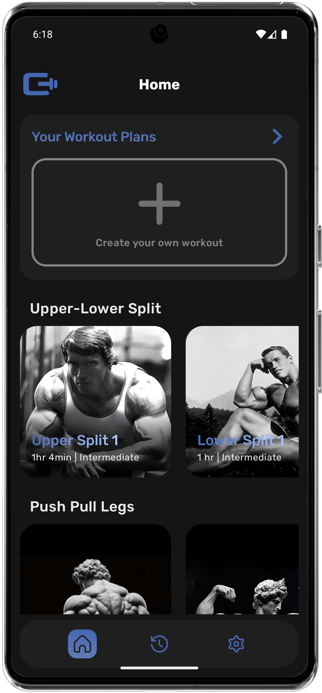
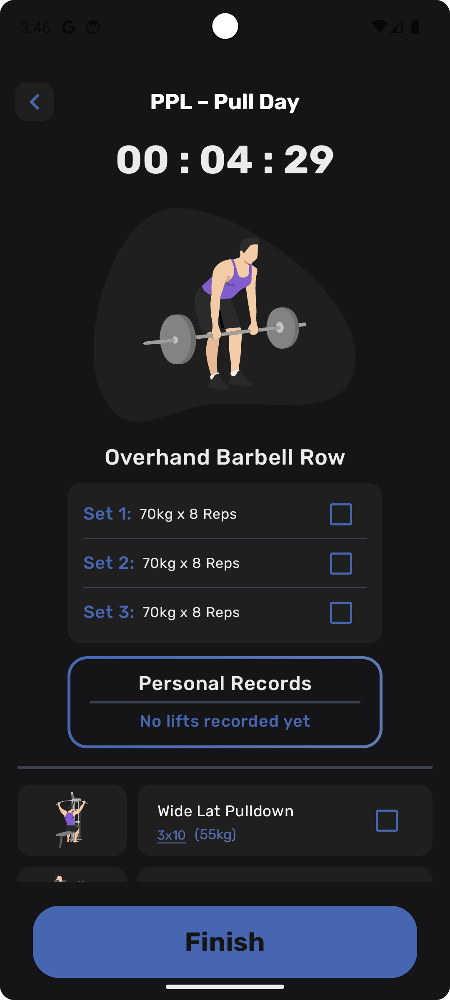
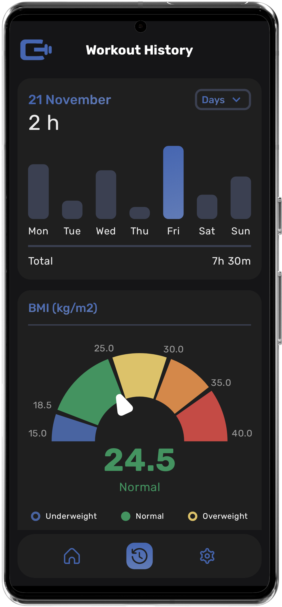
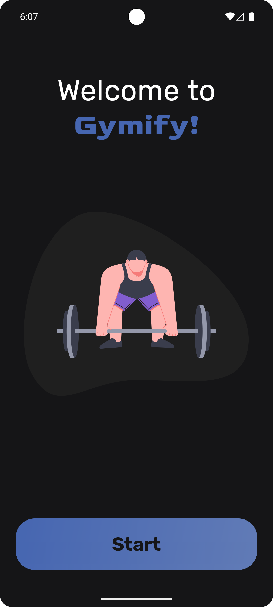
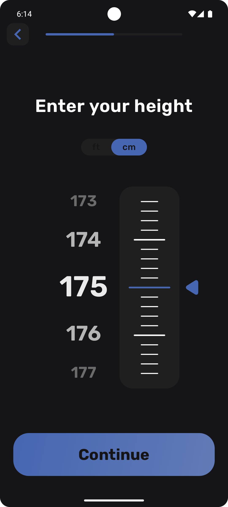
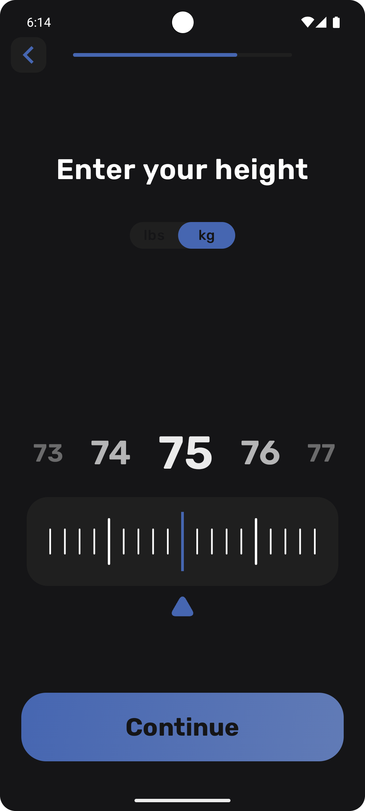
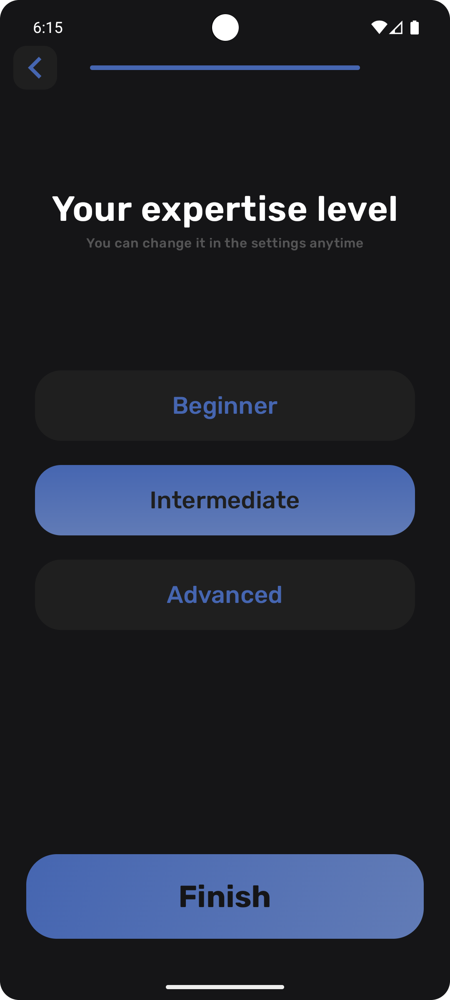

# Gymify — Workout Planner & Gym Tracker 💪🏋️‍♂️

  
  
  

  <b>Your Training Hub</b> • <b>Workout Session</b> • <b>Analytics Dashboard</b>

**Gymify** is your personal gym companion — track your workouts, monitor progress, and design fully customized training plans with ease. Whether you want to record your sets, weights, and reps, or review your weekly, monthly, and yearly performance, Gymify keeps everything at your fingertips. Never forget your last working weight or your personal best again — Gymify remembers it all, helping you maximize your results efficiently.

---

## Project Status

**Current State:** Alpha — Gymify is functional and already helps track workouts, but there’s room for improvements. No active roadmap planned, as this is a personal project.

---

## Features

- **Your Training Hub:** Quick access to recent workouts, pre-made routines, and personalized plans.  
- **Workout Session:** Start workouts, track sets, reps, and weights in real-time.  
- **Analytics Dashboard:** Review your weekly, monthly, and yearly activity; monitor your BMI and progress visually.  
- **Custom Workout Plans:** Create your own workout from scratch, choose exercises from the library, add photos, names, and fully customize your plan.  
- **Exercise Tracking:** Gymify remembers your last set and your personal best for every exercise.  
- **Sign-Up Flow:** Personalized onboarding with gender, height, weight, and expertise selection.  
- **Settings:** Manage profile info, preferences, appearance, language, and support.  
- **Data Persistence:** All progress is safely stored using modern state management with Coroutines, Flow/StateFlow, and DataStore.

---

## Screens / App Walkthrough

## Onboarding
| Welcome | Gender | Height | Weight | Experience Level |
|:-------:|:------:|:------:|:------:|:----------------:|
|  |  |  |  |  |

**Description:** Users complete a personalized onboarding flow to set up their fitness profile.
