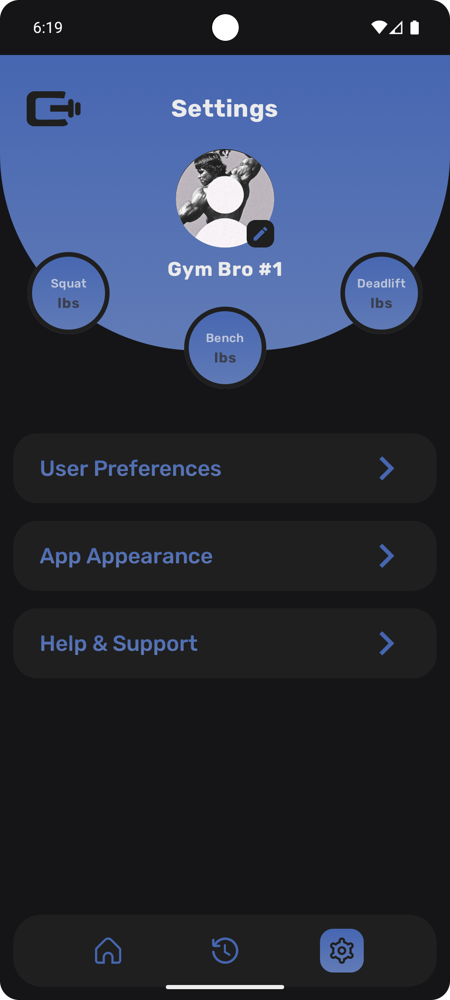
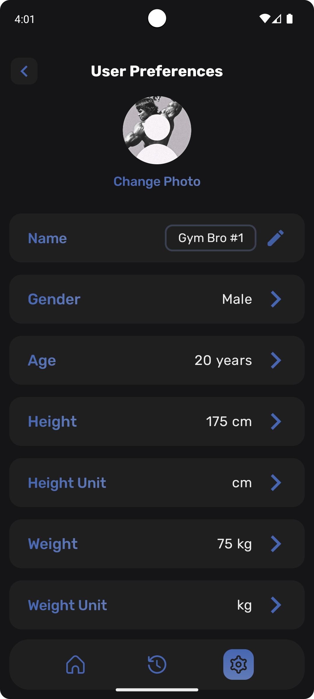
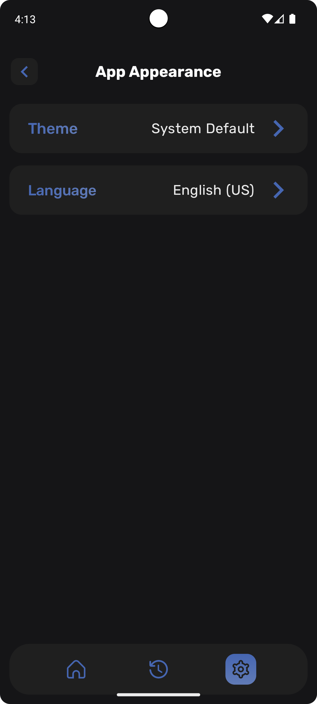
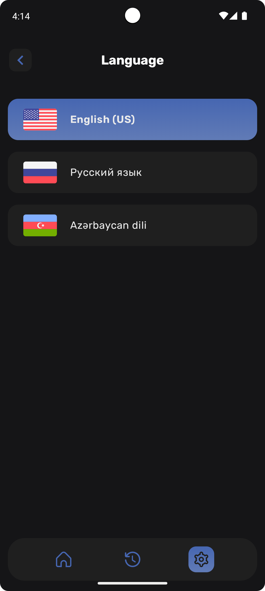

# Gymify – Workout Planner & Gym Tracker

<p align="center">
  
  
  
</p>

<p align="center">
  <strong>Your personal gym companion for tracking workouts and maximizing results</strong>
</p>

<p align="center">
  
  
  
  
</p>

---

## Overview

Gymify is a modern Android workout tracker that helps you design custom training plans, track every set and rep, and visualize your progress over time. Never forget your last working weight or personal best — Gymify remembers everything for you.

**Key Highlights:**
- 📊 Visual analytics with weekly, monthly, and yearly insights
- 🎯 Real-time workout tracking with automatic history
- 💪 Fully customizable workout plans and exercise library
- 🎨 Modern UI built entirely with Jetpack Compose
- 📱 Clean MVI architecture for predictable state management

---

## Features

### Core Functionality
- **Training Hub** — Quick access to recent workouts, routines, and personalized plans
- **Live Workout Sessions** — Track sets, reps, and weights in real-time
- **Exercise Memory** — Automatically recalls your last set and personal best for every exercise
- **Custom Workout Builder** — Create workouts from scratch with photos, names, and full customization
- **Analytics Dashboard** — Monitor activity trends, BMI, and progress with interactive charts
- **Personalized Onboarding** — Setup flow with gender, height, weight, and experience level

### Technical Features
- Offline-first architecture with Room persistence
- Reactive UI updates with Kotlin Flow and StateFlow
- Type-safe navigation with Navigation Compose
- Dependency injection with Hilt
- Modern coroutine-based async operations

---

## Screenshots

### Onboarding Flow
<p align="center">
  
  
  
  
  
</p>

### Main Experience
<p align="center">
  
  
  
  
</p>

### Workout & Analytics
<p align="center">
  
  
  
</p>

### Settings & Customization
<p align="center">
  
  
  
  
</p>

---

## Tech Stack

### Core
- **Kotlin** — Primary language with coroutines for async operations
- **Jetpack Compose** — Fully declarative UI toolkit
- **MVI Architecture** — Unidirectional data flow with clear state management

### Android Components
- **Room** — Local database for workout history and plans
- **DataStore** — Type-safe preferences storage
- **Navigation Compose** — Type-safe screen navigation
- **Hilt** — Dependency injection framework

### Reactive Programming
- **Coroutines** — Structured concurrency
- **Flow/StateFlow** — Reactive data streams and state observation

---

## Architecture

Gymify follows **MVI (Model-View-Intent)** pattern with clean architecture principles for maintainability and testability.

### Architecture Layers

```
┌─────────────────────────────────────────┐
│          Presentation Layer             │
│  ┌────────────────────────────────────┐ │
│  │  Composable Screens (UI)           │ │
│  │  ↕                                 │ │
│  │  ViewModel                         │ │
│  │  • UI State (immutable)            │ │
│  │  • UI Actions/Events               │ │
│  │  • Intent Handlers                 │ │
│  └────────────────────────────────────┘ │
└─────────────────────────────────────────┘
                    ↕
┌─────────────────────────────────────────┐
│            Domain Layer                 │
│  • Use Cases (business logic)           │
│  • Domain Models                        │
│  • Repository Interfaces                │
└─────────────────────────────────────────┘
                    ↕
┌─────────────────────────────────────────┐
│             Data Layer                  │
│  • Repository Implementations           │
│  • Room DAOs                            │
│  • Data Sources                         │
│  • DTO/Entity Mapping                   │
└─────────────────────────────────────────┘
```

### MVI Flow

```
User Intent → ViewModel → State Update → UI Recomposition
     ↑                                         ↓
     └─────────────── User Action ─────────────┘
```

### Key Principles
- **Single Source of Truth** — ViewModels maintain app state
- **Unidirectional Data Flow** — Predictable state transitions
- **Immutable State** — UI State objects are read-only
- **Separation of Concerns** — Clear boundaries between layers
- **Testability** — Each layer can be tested independently

---

## Project Structure

```
app/
├── presentation/
│   ├── screens/
│   │   ├── home/
│   │   │   ├── HomeScreen.kt
│   │   │   ├── HomeViewModel.kt
│   │   │   ├── HomeUiState.kt
│   │   │   └── HomeUiAction.kt
│   │   ├── workout/
│   │   └── analytics/
│   └── theme/
├── domain/
│   ├── usecases/
│   ├── models/
│   └── repositories/
└── data/
    ├── local/
    │   ├── dao/
    │   └── entities/
    ├── repositories/
    └── di/
```

---

## Getting Started

### Prerequisites
- Android Studio Hedgehog (2023.1.1) or later
- Minimum SDK: 24 (Android 7.0)
- Target SDK: 34 (Android 14)
- Kotlin 1.9+

### Installation

1. Clone the repository
```bash
git clone https://github.com/kin-aliyev/gymify.git
cd gymify
```

2. Open in Android Studio
```bash
# Open Android Studio and select "Open an existing project"
# Navigate to the cloned directory
```

3. Build and run
```bash
# Click "Run" or use Shift + F10
# Select your device or emulator
```

---

## Development Status

**Current Phase:** Alpha  
Gymify is functional and actively used for personal training tracking. Features are stable, but UX refinements and additional analytics are planned.

**Note:** This is a personal project without a formal roadmap. Updates are made based on personal needs and learning goals.

---

## Future Considerations

- Cloud backup and sync
- Exercise video demonstrations
- Social features (share workouts)
- Advanced analytics (volume load, progressive overload tracking)
- Wear OS companion app

---

## Contributing

While this is primarily a personal project, feedback and suggestions are welcome! Feel free to:
- Open issues for bugs or feature requests
- Submit pull requests for improvements
- Share your thoughts on architecture or UX

---

## License

This project is available under the MIT License. See `LICENSE` file for details.

---

## Contact

**Developer:** Ilkin Aliyev  
**Email:** ilk.aliev04@gmail.com  
**GitHub:** [@kin-aliyev](https://github.com/kin-aliyev)

---

<p align="center">Made with ❤️ and Kotlin</p>
